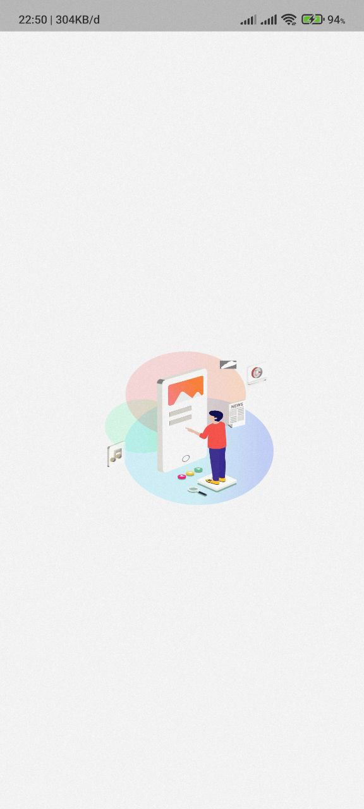
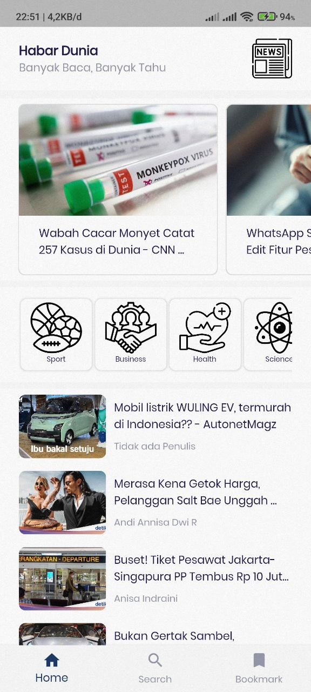
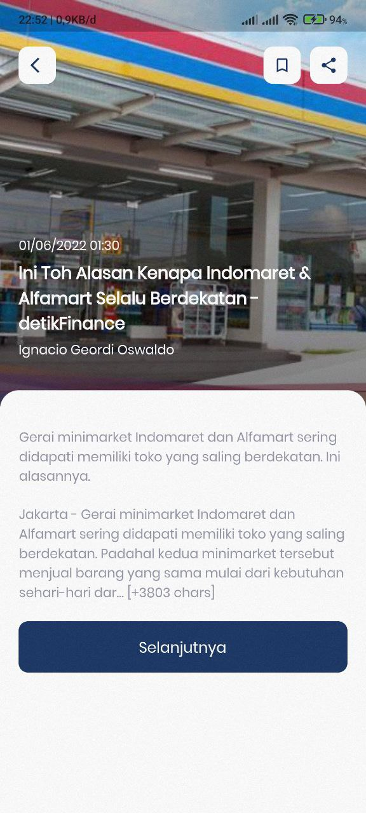
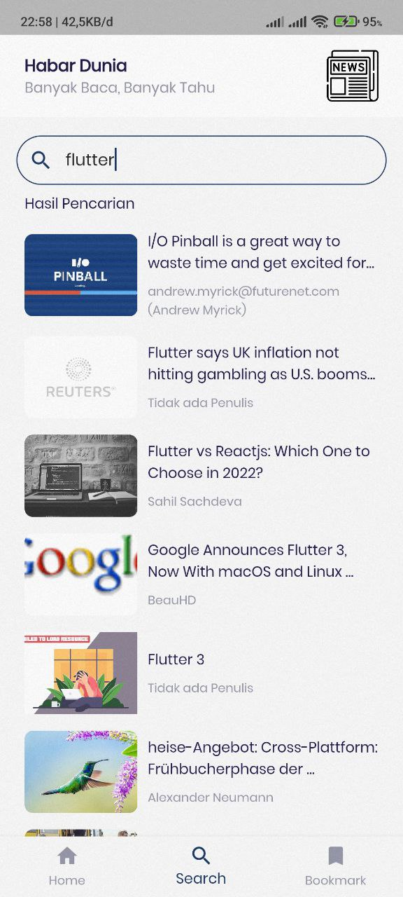
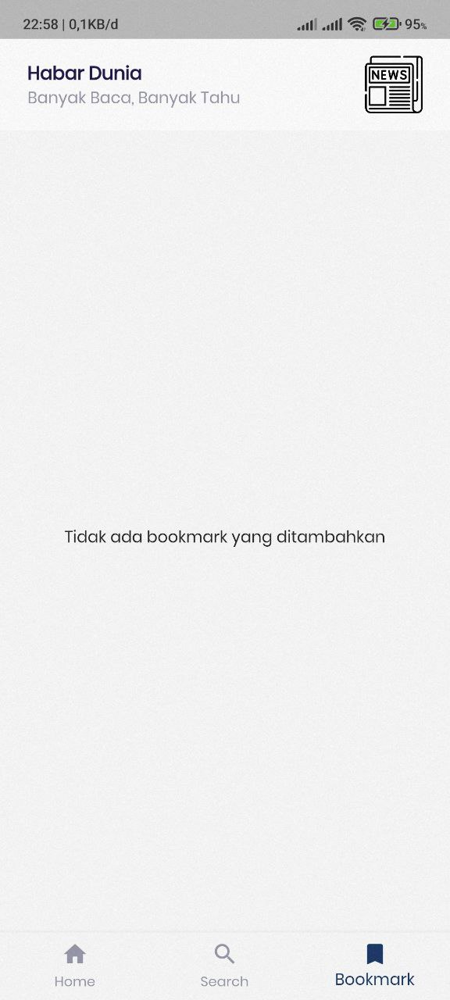
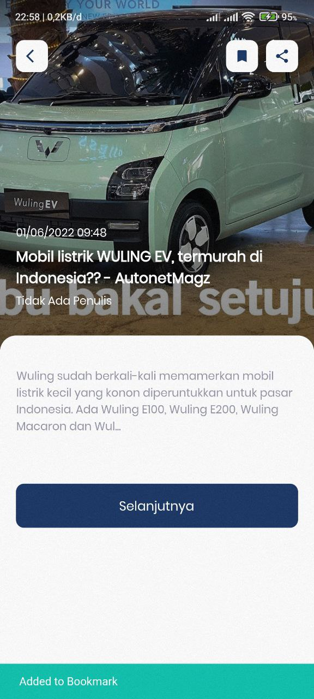
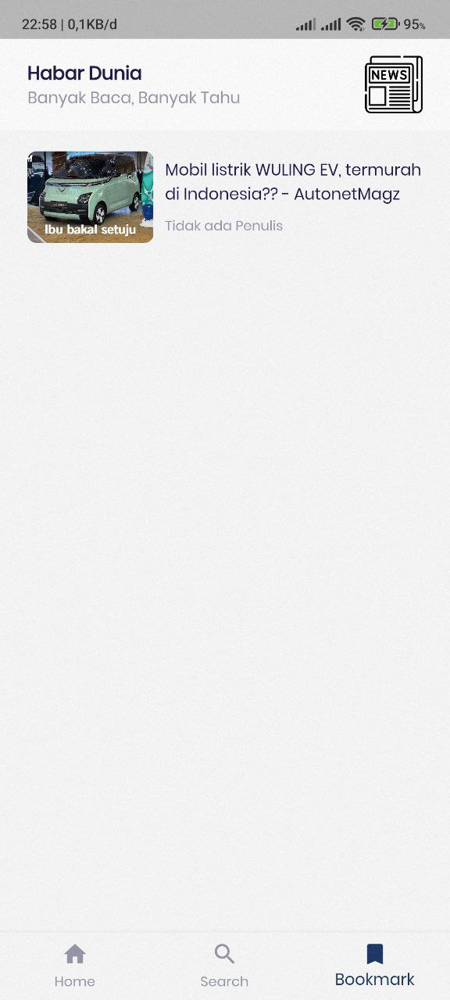
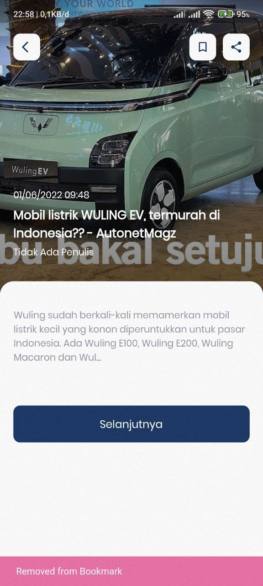

# PRAKTIKUM ANDROID UNISKA MAB

## STUDI KASUS MEMBUAT APLIKASI BERITA MENGGUNAKAN FLUTTER FRAMEWORK DAN NEWSAPI.ORG

### (Dosen Pembimbing : `MUHARIR, M.Kom`)

######################################################################################################

Splash Screen

Halaman Utama

Detail Berita

Halaman Pencarian

Halaman Bookmark

Simpan ke Bookmark

Daftar Bookmark

Hapus dari Bookmark

